# Super Blog · blog-client (Frontend)

> A blog frontend built with Vue 3 + TypeScript + Vite 5 + Element Plus, paired with a Spring Boot backend.
>
> [中文 README →](./README.md)

## 🔗 Repositories

| Side | Repository |
|------|------------|
| **Frontend blog-client (this repo)** | https://github.com/vfaner/blog-client |
| **Backend blog-server** | https://github.com/vfaner/blog-server |

If this project helps you, please give it a ⭐️ **Star** — that's the best way to support ongoing open-source work!

---

## ✨ Screenshots

### Home page
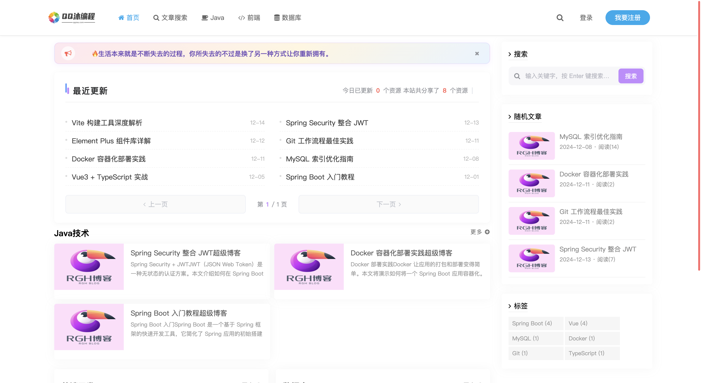

### Front-end pop-up login
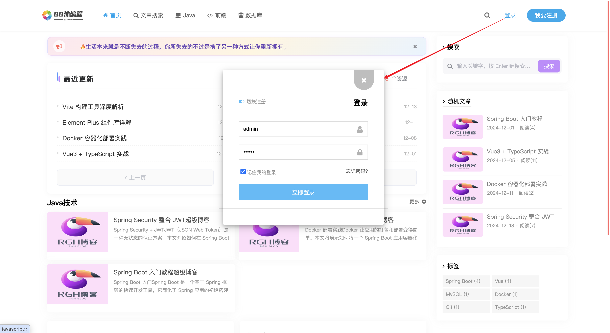

### Standalone login page (redirected to when hitting `/admin/*` unauthenticated)
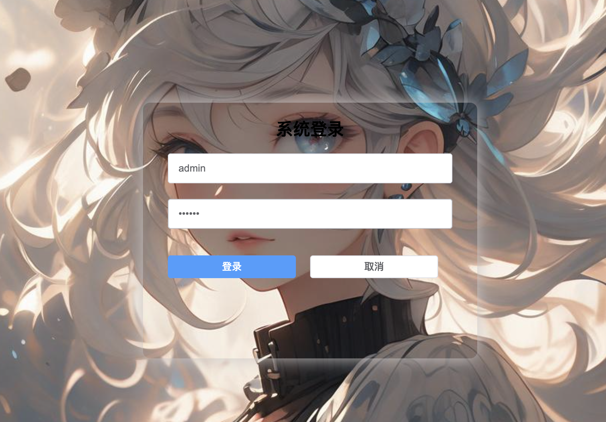

### Category article list
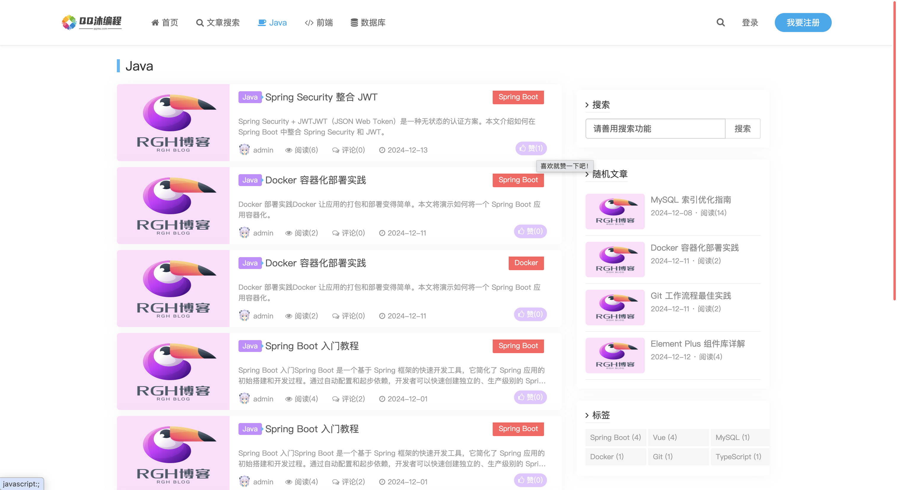

### Article detail
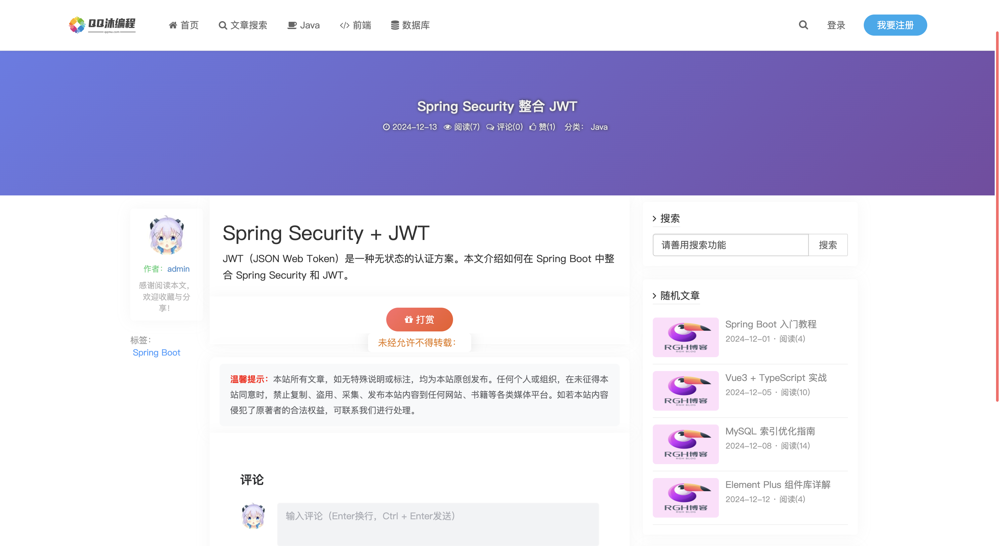

### Front-end user center
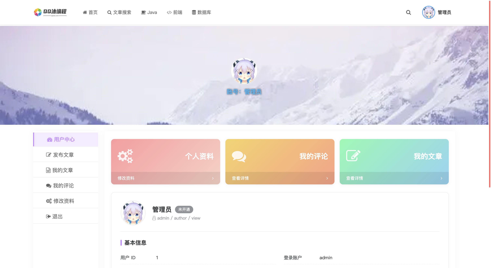

### Admin dashboard
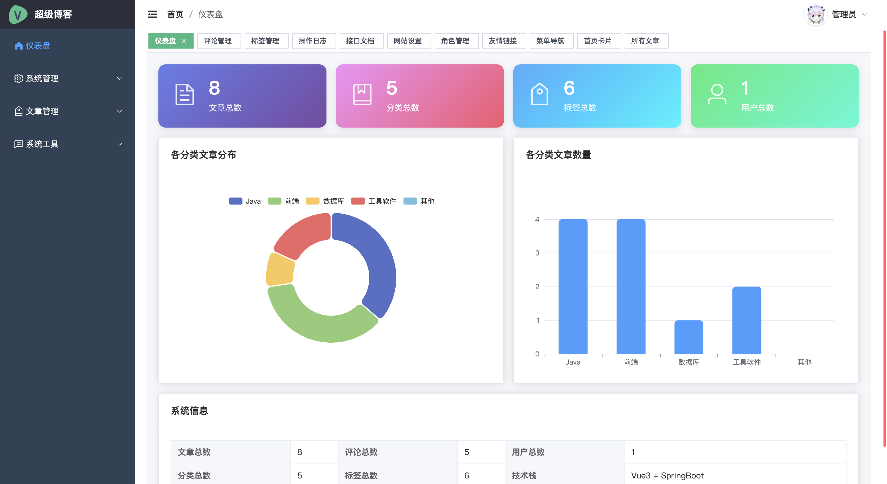

### Admin article management
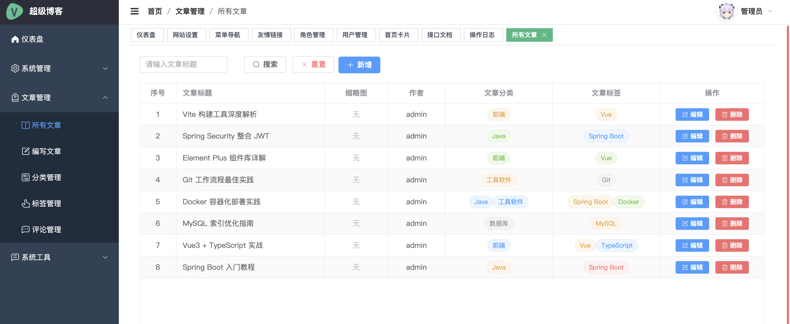

### Admin article editor
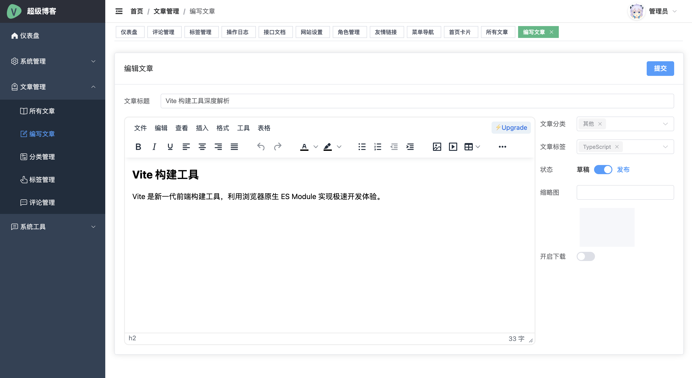

### Admin role management
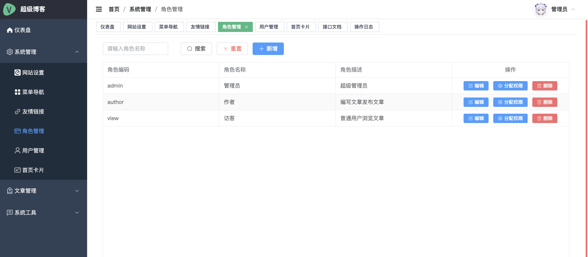

### Admin comment management
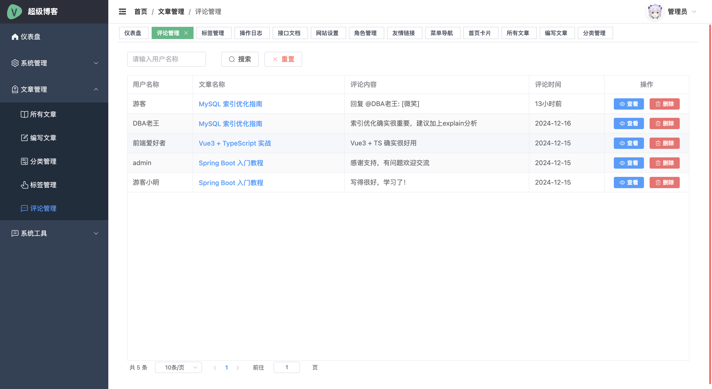

---

## 🚀 Tech Stack

- **Vue 3.4** (Composition API + `<script setup>`)
- **TypeScript 5.5**
- **Vite 5.4**
- **Element Plus 2.7**
- **Vue Router 4** / **Vuex 4**
- **Axios 1.7**
- **ECharts 5.5** (dashboard charts)
- **TinyMCE 6** (rich-text editor)
- **undraw-ui** (comment widget)

## 📦 Features

- Frontend: dynamic home cards, category / tag pages, search, article detail, comments, likes, tipping
- Admin: dashboard, articles / categories / tags / comments / links / menus / roles / users management
- Dynamic document titles (category page = category name, tag page = tag name, detail page = article title)
- Client-side pagination on top of server aggregated payloads
- Mobile bottom navigation (togglable, any items configurable)
- Two login flows: modal on home page & standalone login page
- Fully dynamic routes & menus (delivered by the backend)

## 🏃 Quick Start

### Requirements
- Node.js 18+
- npm / pnpm / yarn — any works

### 1. Install dependencies

```bash
npm install
```

### 2. Start dev server

```bash
npm run dev
```

Default URL: http://localhost:8080

> The port declared in `vite.config.ts` is **8080**. If it's already in use, Vite will automatically fall back to the next free port (8081, 8082, …). The actual port is printed in the terminal on startup.

### 3. Build for production

```bash
npm run build
```

Output goes to `dist/`.

### 4. Type check

```bash
npm run type-check
```

## ⚙️ Backend API

`vite.config.ts` already proxies `/rgh/api` to `http://localhost:8090`.

If your backend lives elsewhere, adjust `server.proxy` in `vite.config.ts`.

## 🗂 Project Layout

```
blog-client/
├── src/
│   ├── api/                # HTTP wrappers
│   ├── assets/             # Static assets
│   ├── common/             # Public-side components (home, nav, comment, reward, …)
│   ├── components/         # Global components
│   ├── composables/        # Composables
│   ├── layout/             # Admin layout
│   ├── router/             # Router
│   ├── store/              # Vuex
│   ├── utils/              # Utilities (date, auth, clipboard, …)
│   └── views/              # Admin views
├── public/
├── index.html
├── vite.config.ts
├── tsconfig.json
└── package.json
```

## 🧩 Backend Integration

Backend project: https://github.com/vfaner/blog-server

Once the backend is up (see its README), the frontend can hit every API through the pre-wired Vite proxy.

Default front-end credentials (the home popup uses backend admin, regular users can also register):

| Username | Password |
|----------|----------|
| admin    | 123456   |

---

## ❤️ Sponsor & Star

If this project helps you, feel free to buy me a coffee ☕️:


> And please don't forget to smash that ⭐️ **Star** button at the top-right!

## 📄 License

MIT
